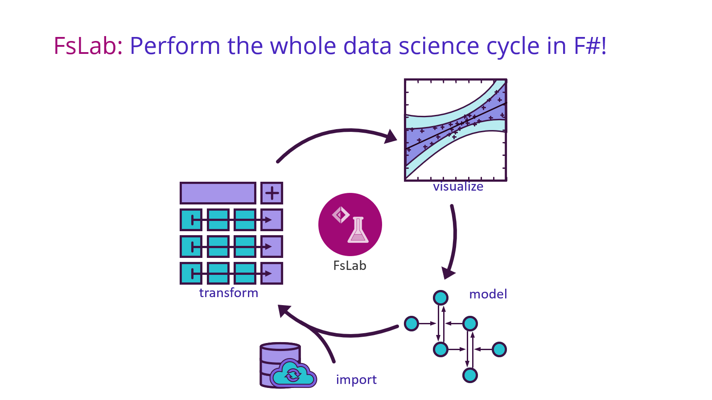

# Hi there! :wave: We are FsLab

## About FsLab
FsLab is a center of gravity for data science projects written in and/or for F#. Our vision is to provide a safe haven for these projects to align their APIs, find new contributors and/or maintainers, and catalyze the formation of a coherent, productive data science environment for F# and .NET.

More information is available on https://fslab.org.

## How does it work?

FsLab in its current form is quite new, which also means that there are no strong guidelines and established processes - which might actually be one of its strengths. We currently offer projects to "join" FsLab in 3 ways:

- Make your project a FsLab project by moving the project to the FsLab github organization. Depending on the size of your project, this can increase the visibility of your project the most. You will of course retain ownership of the repo, but FsLab admins will have access as well (and can serve as backup maintainers). Examples of projects that took this road are [FSharp.Stats](https://github.com/fslaborg/FSharp.Stats) and [flips](https://github.com/fslaborg/flips). _Please note that this does not mean that FsLab admins are automatically obliged to maintain your project - it is still yours._

- Make your project a FsLab-endorsed project by creating [high quality tutorial and blog post content](https://fslab.org/tutorials) for FsLab and/or using the [FsLab theme](https://github.com/fslaborg/docs-template) for your project documentation
